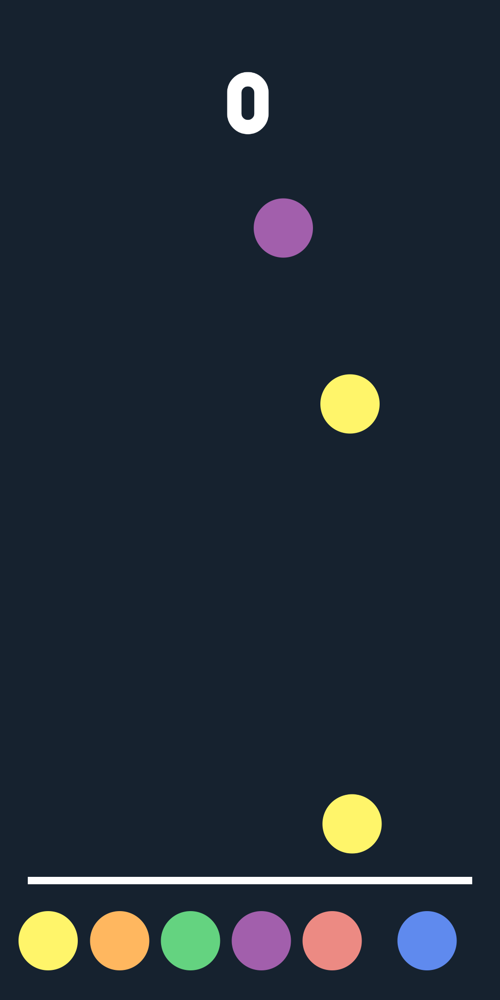

# Matching Color
Matching Color is a hyper-casual game where you throw colors at matching targets to score points! 🎨✨ If the wrong color hits or colors reach the ground, it's game over!

Think you have the reflexes to keep up? Jump in and test your skills! 🚀🎮

## Screenshots

  
  

## Download
- [:sparkles: Download from Itch.io](https://hieubigby.itch.io/matching-colors)

## Credits
- [Original Project](https://github.com/zerefgd/ColorfulChaos)
- Game Engine: [Unity](https://unity3d.com/)
- Thanks to all of the game development community for their awesome help.
